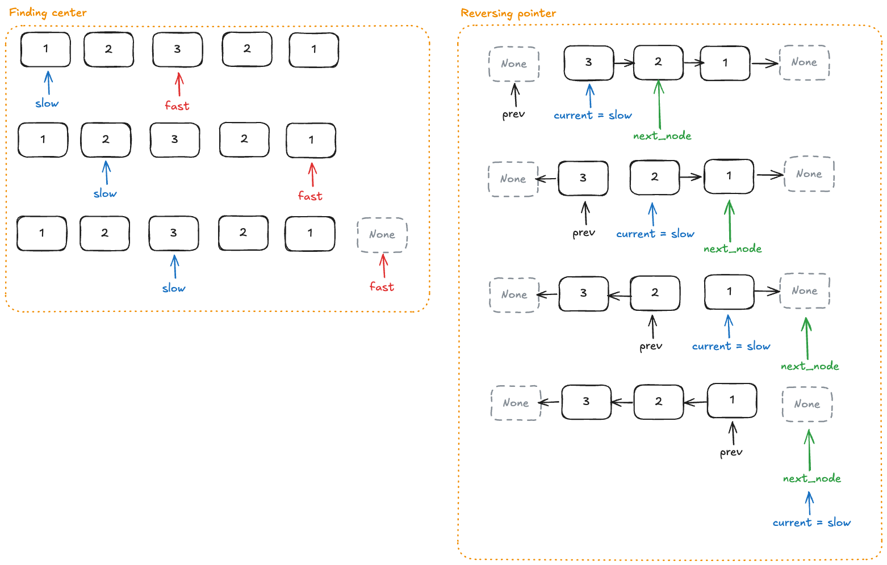

# Patient Health Record Symmetry Analysis

## Overview
Determine whether a singly linked list of health metrics
is symmetrical (palindrome).

## Files
- `health_record.py` — Node class + isHealthRecordSymmetric() function
- `test_health_record.py` — Unit tests (3 normal + 3 edge cases)

## Approach
3-step process:
1. Find the middle using Fast/Slow pointers
2. Reverse the second half using 3 pointers (prev, current, next_node)
3. Compare first half and reversed second half node by node

## Time & Space Complexity
| Method | Time | Space |
|---|---|---|
| isHealthRecordSymmetric() | O(n) | O(1) |