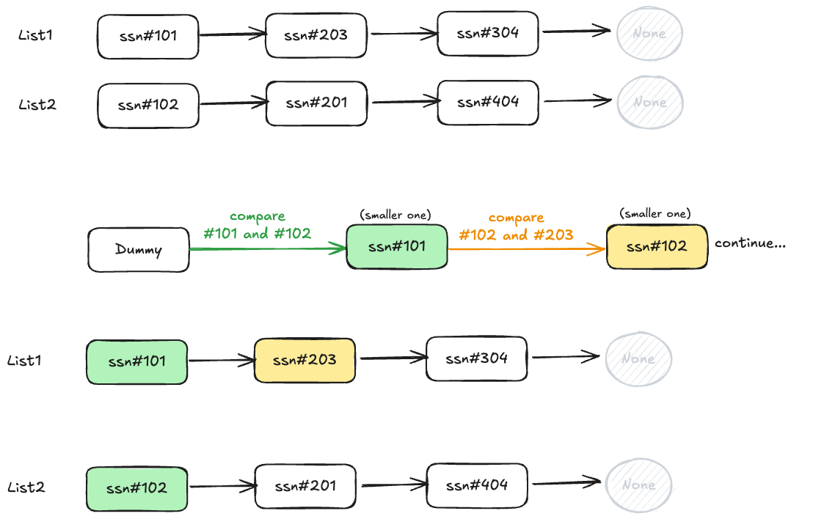

# Integrating Patient Records from Two Healthcare Providers

## Overview
Merge two sorted linked lists of patient records (sorted by SSN)
into one single sorted linked list.

## Files
- `patient_records.py` — Patient class + mergeSortedLists() + display() functions
- `test_patient_records.py` — Unit tests (3 normal + 3 edge cases)

## Approach
1. Use two pointers — one for each list
2. Compare SSNs at each step, attach the smaller one to the result
3. Once one list runs out, attach the remaining nodes directly
4. Use a dummy node as a clean starting point

Note: No new list is created — existing nodes are reused
by rewiring their next pointers.

## Time & Space Complexity
| Method | Time | Space |
|---|---|---|
| mergeSortedLists() | O(n+m) | O(1) |
| display() | O(n) | O(n) |