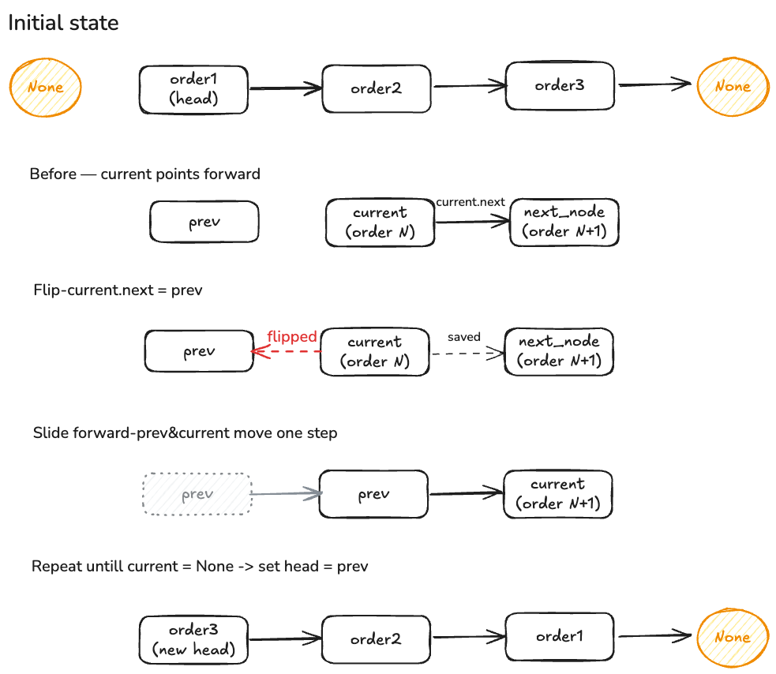

# E-Commerce Order Processing System

## Overview
Reverse a singly linked list of orders so the most recent order is processed first (LIFO).

## Files
- `order.py` — Order, Node, OrderLinkedList classes
- `test_order.py` — Unit tests (3 normal + 3 edge cases)

## Approach
Use 3 pointers (prev, current, next_node) based on current:
1. Save next_node
2. Flip current.next → prev
3. Slide prev and current one step forward

Repeat until current = None, then set head = prev.

## Time & Space Complexity
| Method | Time | Space |
|---|---|---|
| append() | O(n) | O(1) |
| display() | O(n) | O(1) |
| reverse() | O(n) | O(1) |